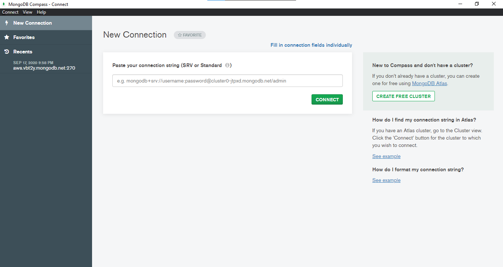

# Connecting to MongoDB Using Compass

In this section we will using MongoDB Compass for connect to our MongoDB Atlas cluster.

1. First, we need to Download MongoDB Compass here [MongoDB Download Center](https://www.mongodb.com/download-center/v2/compass)    _Choose the right Version, Operating System, and Package for your machine_   

2. Then, we need to install and launch MongoDB Compass  

3. Compass Provide 2 way to connect into our MongoDB server:
  
    **Using connection string**  
    Using connection string is the simplest way to connect our MongoDB Server. We just need to paste connection string from Atlas Dashboard and change the password with password that generated from Atlas Web Console.  
      

    **Filling out deployment information in individual fields**  
    If the connection string didn't work, we can manually fill in the individual fields and try to connect using that way instead.
     1. Click on _Fill in connection fields individually_ and fill the connection form     

     2. For choosing Replica Set we can tap into More Options then change name of Replica Set   

4.  